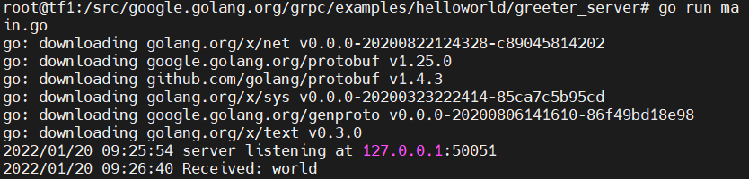
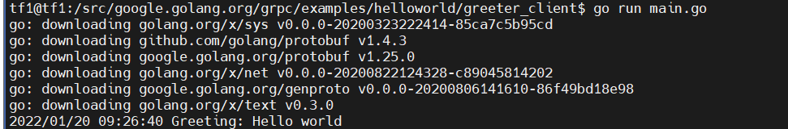

# grpc tutorial


## 基本介绍

gRPC是google开发的一个RPC框架，跨语言，跨平台，基于Protobuf序列化协议。简单的说就是：是一个RPC框架，使用Protobuf序列化数据。


## 

## 初体验
尝试了其他方法，感觉安装体验很不好，这个方法是最快完成的。
安装步骤：

```shell
a. grpc
mkdir -p $GOAPTH/src/google.golang.org
cd $GOAPTH/src/google.golang.org
git clone https://github.com/grpc/grpc-go.git
mv grpc-go grpc
b. genproto
git clone https://github.com/google/go-genproto.git
mv go-genproto genproto
```

运行：
```shell
cd greeter_server 
go run main.go
cd greeter_client
go run main.go
```

服务端



客户端




## Protobuf

#### proto文件

Protobuf文件以 **.proto**作为文件后缀，**在.proto文件里定义好数据结构之后，就可以用工具将这个文件翻译成具体的代码**。来看看.proto文件怎么写的

```
syntax = "proto3"; // 使用proto3版本语法，2和3版本的语法有些差异，这里使用3

message Person {
    string name = 1;
    int32 age = 2;
    repeated string address = 3;
}

```


## 参考连接

[go 安装指定版本](https://blog.csdn.net/u013288190/article/details/117318918)
[grpc 安装以及墙的解决方法](https://www.cnblogs.com/rongfengliang/p/8480790.html)
[Linux环境下编译grpc](https://blog.csdn.net/y601500359/article/details/114531937)