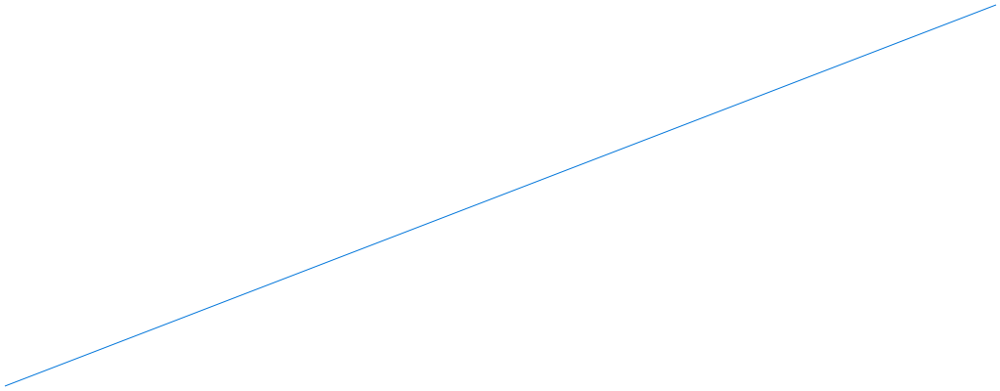

# go mod 使用

使用`chart`来画图

```go
// Go file
/***********************************************
# Copyright (c) 2022, XiAn
# All rights reserved.
#
# @Filename: package.go
# @Version：V1.0
# @Author: ftang - tfxidian@163.com
# @Description:
# @Create Time: 2022-03-12 13:14:30
# @Last Modified: 2022-03-12 13:14:30
***********************************************/

package main

import(
    "fmt"
    "github.com/tfxidian/go-tutorial/quick_tutorial/numbers"
)


func main(){
    fmt.Println(numbers.Absolute(-4))
    fmt.Println(numbers.IsPrime(19))
}

```

使用 go run chart.go报错信息如下：
```
go run chart.go
chart.go:10:2: no required module provides package github.com/wcharczuk/go-chart: go.mod file not found in current directory or any parent directory; see 'go help modules'

```
意思是go-chart的相关依赖不存在，需要go mod来存放。

查找了一下资料，处理方法如下：
```
go mod init myproject
go test
```

使用go test 后
```
tf@tf:~/goproject$ go test
chart.go:10:2: no required module provides package github.com/wcharczuk/go-chart; to add it:
        go get github.com/wcharczuk/go-chart

```
按照提示`go get github.com/wcharczuk/go-chart`

之后`go  run chart.go`即可成功运行，图示如下：



